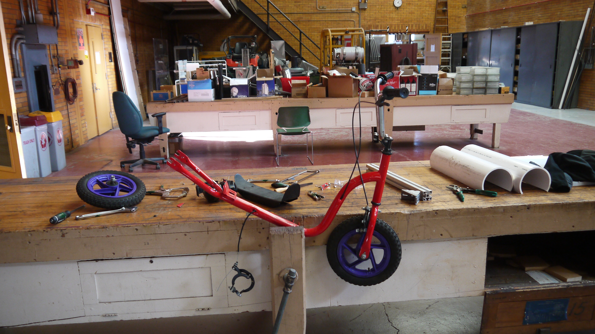

+++
# Project title.
title = "Ultimate Deathtrap: The Danger Scooter"

# Date this page was created.
date = 2019-02-18T00:00:00

# Project summary to display on homepage.
summary = "80s childrens’ kick-scooter converted into an electric 20mph monstrosity"

# Tags: can be used for filtering projects.
# Example: `tags = ["machine-learning", "deep-learning"]`
tags = ["power electronics", "hardware hacks", "electronics", "mechanical design"]

# Optional external URL for project (replaces project detail page).
# external_link = "http://example.org"

# Featured image
# To use, add an image named `featured.jpg/png` to your project's folder.
[image]
# Caption (optional)
#  caption = "caption here"

# Focal point (optional)
# Options: Smart, Center, TopLeft, Top, TopRight, Left, Right, BottomLeft, Bottom, BottomRight
  focal_point = "Smart"

# Does the project detail page use math formatting? (old version of hugo site)
# math = false

+++

# Timeline
Feb 2017 - Current

# Project Description
This project was spawned by a desire to make my daily commute to class faster. Being a poor grad student, paying for a campus parking pass was out of the question. I could have bought a bike, but when I found an old 80s kick scooter on Craigslist, I couldn't resist the temptation to build something ridiculous.

# Project Description
The build is fairly simple: a brushless hubmotor+wheel rescued from a dumpster replaces the rear wheel of the scooter. A cheap Chinese ebike motor controller and a trio of old NiCad drill batteries make up the power system. Paired with a handle throttle form Amazon, and I was good to go after a wee bit of hacksawing. Given that most of the parts were either found, Craigslisted on the cheap, or donated by generous well-wishing friends, this build was kept under the $50 mark. 

Version 2 of this scooter replaced the drill batteries with 4 lithium-iron-phosphate battery packs very generously donated by a friend. These batteries were production prototypes of devices meant to be drop-in replacements for gel lead-acid batteries in backup applications. Unlike the old drill batteries, these are not as severely affected by the Minnesota cold, and they have a much higher energy and power density. I get 5Ah@56V with this battery arrangement, instead of <2Ah@48V. With the new pack, I got greatly increased range and acceleration and slightly increased top speed. Charging is accomplished using a Meanwell LED streetlight power supply (which does the constant-current regulation the batteries need to not get angry).

The most recent set of improvements added a speedometer, bell, tail lights, and a 12V LED headlight powered from the 56V battery pack through a buck converter.

Believe it or not, I used to ride this horrible thing to school nearly every day (except in winter, mostly). It has a top speed of a little over 20mph and a 16 mile range. Planned improvements include a less terrifyingly bendy chassis and perhaps some better brakes. I've purchased a bike disc brake conversion kit and an adapter ring that should fit the hubmotor, so all that's left is to modify the frame to enable mounting the calipers!
 

# Project Links
- [Github repo for original build](https://github.com/KeiranCantilina/Ultimate-Deathtrap-old-chassis)
- [Github repo for speedometer](https://github.com/KeiranCantilina/Arduino-Scooter-Speedometer)
- [Github repo for new chassis design ](https://github.com/KeiranCantilina/Ultimate-Deathtrap-New-Chassis) (mostly CAD files right now)

# Acknowledgements
Thanks to Hanna Lin for help with building, and to Dane Kouttron for donating parts (and for carrying some really weird looking stuff through airport security screening).

# Project Photos










