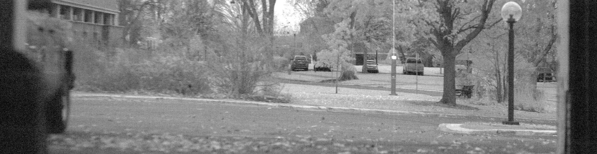
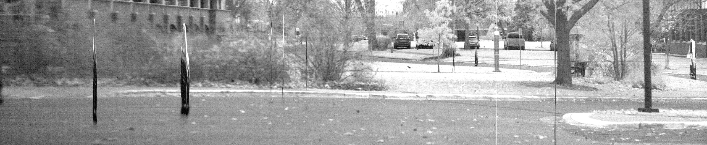
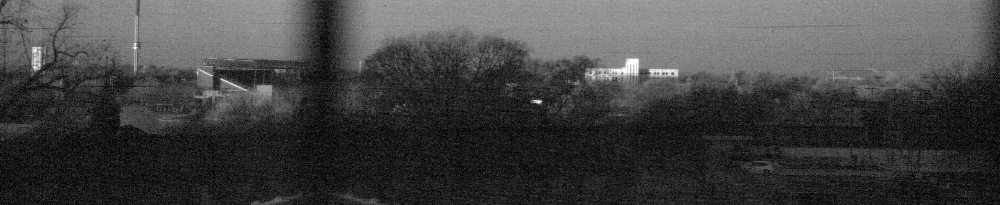

+++
# Project title.
title = "The Scanmera"

# Date this page was created.
date = 2019-02-15T00:00:00

# Project summary to display on homepage.
summary = "Microtek ScanMaker4900 flatbed scanner modified into a large-format VIS-NIR multispectral camera"

# Tags: can be used for filtering projects.
# Example: `tags = ["machine-learning", "deep-learning"]`
tags = ["sensors", "hardware hacks", "photography", "instrumentation"]

# Optional external URL for project (replaces project detail page).
# external_link = "http://example.org"

# Featured image
# To use, add an image named `featured.jpg/png` to your project's folder.
[image]
# Caption (optional)
#  caption = "caption here"

# Focal point (optional)
# Options: Smart, Center, TopLeft, Top, TopRight, Left, Right, BottomLeft, Bottom, BottomRight
  focal_point = "Smart"

# Does the project detail page use math formatting? (old version of hugo site)
# math = false

+++

# Timeline
Nov 2017 - Current

# Project Description
This project began as a just-for-fun repurposing of an obsolete scanner, but I soon discovered that the linear CCD in this scanner is very sensitive to near-infrared (NIR) wavelengths. This sensitivity, along with the high resolution of images produced by the Scamera, means that I can potentially use it to measure the health of crops in fields by measuring the Normalized Difference Vegetation Index (NDVI), which is based on relative Red/IR reflectivity of plants. You can see how brightly vegetation shows up in the photos below.

The Scamera uses a 330mm doublet lens from an abandoned overhead projector. The modified imaging assembly is so sensitive to IR that cardboard isn’t sufficiently opaque, hence the foil. The only way to control exposure and depth of field is by using laser-cut cardboard apertures because there is no shutter.

Future work involves a chassis overhaul (for better portability), improved lightproofness (which should fix contrast issues), and a more stable power supply (which should reduce the severe noise issue visible in pictures).

# Project Links
- [Github repo](https://github.com/KeiranCantilina/Scanmera)
- [Full-resolution project images ](https://drive.google.com/open?id=11ls2AhE8IGYdJVQsz3RzfAySejQ5RCwX)(Note: Many images produced by the camera have a 1:5 pixel aspect ratio)

# Acknowledgements
 Thanks to Dr. Pete Marchetto for making acquisition of the scanner possible, and thanks to Dane Kouttron for help troubleshooting the noise issue.
 
 Much life-debt was owed to Hanna Lin for standing out in sub-0 temperatures with me while I carted around a silly contraption.

# Project Photos

